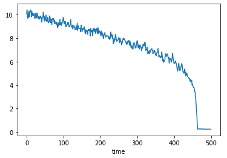

[](https://badge.fury.io/py/ewstools)
[](https://pepy.tech/project/ewstools)
[](https://ewstools.readthedocs.io/en/latest/?badge=latest)
[](https://github.com/ThomasMBury/ewstools/actions/workflows/tests.yml)
[](https://codecov.io/gh/ThomasMBury/ewstools)

# ewstools
**A Python package for early warning signals (EWS) of bifurcations in time series data.**

## Overview

Many systems across nature and society have the capacity to undergo an abrupt and profound change in their dynamics. From a dynamical systemes perspective, these events are often associated with the crossing of a bifurcation. Early warning signals (EWS) for bifurcations are therefore in high demand. Two commonly used EWS for bifurcations are variance and lag-1 autocorrelation, that are expected to increase prior to many bifurcations due to critical slowing down ([Scheffer et al. 2009](https://www.nature.com/articles/nature08227)). There now exist a wealth of other EWS based on changes in time series dynamics that are expected to occur prior to bifurcations (see e.g. [Clements & Ozgul 2018](https://onlinelibrary.wiley.com/doi/full/10.1111/ele.12948)). More recently, deep learning classifiers have trained and applied to detect bifurcations, with promising results ([Bury et al. 2021](https://www.pnas.org/doi/10.1073/pnas.2106140118)).

The goal of this Python package is to provide a an accessible toolbox for computing, analysing and visulaising EWS in time series data. It complements an existing EWS package in R ([Dakos et al. 2012](https://journals.plos.org/plosone/article?id=10.1371/journal.pone.0041010)). We hope that having an EWS toolbox in Python will allow for additional testing, and appeal to those who primarily work in Python.

Current functionality of *ewstools* includes

  - Time series detrending methods using
    - A Gaussian kernel
    - LOWESS (Locally Weighted Scatterplot Smoothing)

  - Computation of CSD-based early warning signals including:
    - Variance and associated metrics (standard deviation, coefficient of variation)
    - Autocorrelation (at specified lag times)
    - Higher-order statistical moments (skewness, kurtosis)
    - Power spectrum and associated metrics

  - Computation of Kendall tau values to quantify trends
  
  - Application of deep learning classifiers for bifurcation prediction as in [Bury et al. (2022) PNAS](https://www.pnas.org/doi/10.1073/pnas.2106140118).

  - Block-bootstrapping of time-series to obtain confidence intervals on EWS estimates
  
  - Visualisation tools to display output

*ewstools* makes use of [pandas](https://pandas.pydata.org/) for dataframe handling, [numpy](https://numpy.org/) for fast numerical computing, [plotly](https://plotly.com/graphing-libraries/) for visuliastion, [lmfit](https://lmfit.github.io/lmfit-py/) for least-squares minimisation, [arch](https://github.com/bashtage/arch) for bootstrapping methods, [statsmodels](https://www.statsmodels.org/stable/index.html) and [scipy](https://scipy.org/) for detrending methods, and [TensorFlow](https://www.tensorflow.org/install) for deep learning.


## Install

Requires Python 3.7 or later. You can install *ewstools* with pip using the commands

```bash
pip install --upgrade pip
pip install ewstools
```

[Jupyter notebook](https://jupyter.org/install) is required for the tutorials, and can be installed with the command
```bash
pip install jupyter notebook
```
Package dependencies of *ewstools* are
```bash
'pandas>=0.23.0',
'numpy>=1.14.0',
'plotly>=2.3.0',
'lmfit>=0.9.0', 
'arch>=4.4',
'statsmodels>=0.9.0',
'scipy>=1.0.1',
```
and should be installed automatically. To use any of the deep learning functionality, you will need to install [TensorFlow](https://www.tensorflow.org/install) v2.0.0 or later.

To install the latest *development* version of *ewstools*, use the command
```bash
pip install git+https://github.com/thomasmbury/ewstools.git#egg=ewstools
```
NB: the development version comes with the risk of undergoing continual changes, and has not undergone the level of scrutiny of official releases.


## Tutorials/Demonstrations

1. [Introduction to *ewstools*](./tutorials/tutorial_intro.ipynb)
2. [Spectral EWS](./tutorials/tutorial_spectral.ipynb)
3. [Deep learning classifiers for bifurcation prediction](./tutorials/tutorial_deep_learning.ipynb)


## Quick demo

First we need to import *ewstools* and collect the data we wish to analyse. Here we will run a simulation of the Ricker model, one of the model functions stored in [`ewstools.models`](https://ewstools.readthedocs.io/en/latest/ewstools.html#ewstools-models-submodule).
```python
import ewstools
from ewstools.models import simulate_ricker
series = simulate_ricker(tmax=500, F=[0,2.7])
series.plot();
```


We then make a [`TimeSeries`](https://ewstools.readthedocs.io/en/latest/ewstools.html#ewstools.core.TimeSeries) object, which takes in our data and a transition time (if desired). EWS are not computed beyond the transition time.

```python
ts = ewstools.TimeSeries(data=series, transition=440)
```

We can then detrend, compute EWS and calculate Kendall tau statistics by applying methods to the [`TimeSeries`](https://ewstools.readthedocs.io/en/latest/ewstools.html#ewstools.core.TimeSeries) object:

```python
ts.detrend(method='Lowess', span=0.2)
ts.compute_var(rolling_window=0.5)
ts.compute_auto(lag=1, rolling_window=0.5)
ts.compute_auto(lag=2, rolling_window=0.5)
ts.compute_ktau()
```

Finally, we can view output as an interactive [Plotly](https://plotly.com/python/) figure (when run in a Jupyter notebook) using

```python
ts.make_plotly()
```


More detailed demonstrations can be found in the tutorials, and all methods are listed in the documentation.

## Documentation

Available on [ReadTheDocs](https://ewstools.readthedocs.io/en/latest/).

## Issues

If you have any suggestions or find any bugs, please post them on the [issue tracker](https://github.com/ThomasMBury/ewstools/issues). I also welcome any contributions - please get in touch if you are interested, or submit a pull request if you are familiar with that process.

## Acknowledgements

This work is currently supported by an FRQNT (Fonds de recherche du Québec - Nature et Technologies) postdoctoral research scholarship awarded to Dr. Thomas Bury. In the past, it was supported by NSERC (Natural Sciences and Engineering Research Council) Discovery Grants awarded to Dr. Chris Bauch and Dr. Madhur Anand.

## Citation info

If your research uses the deep learning functionality of *ewstools*, please cite

Bury, Thomas M., et al. "[Deep learning for early warning signals of tipping points.](https://www.pnas.org/doi/abs/10.1073/pnas.2106140118)" *Proceedings of the National Academy of Sciences* 118.39 (2021): e2106140118.

If your research computes spectral EWS using *ewstools*, please cite

Bury, Thomas M., Chris T. Bauch, and Madhur Anand. "[Detecting and distinguishing tipping points using spectral early warning signals.](https://royalsocietypublishing.org/doi/full/10.1098/rsif.2020.0482)" *Journal of the Royal Society Interface* 17.170 (2020): 20200482.
